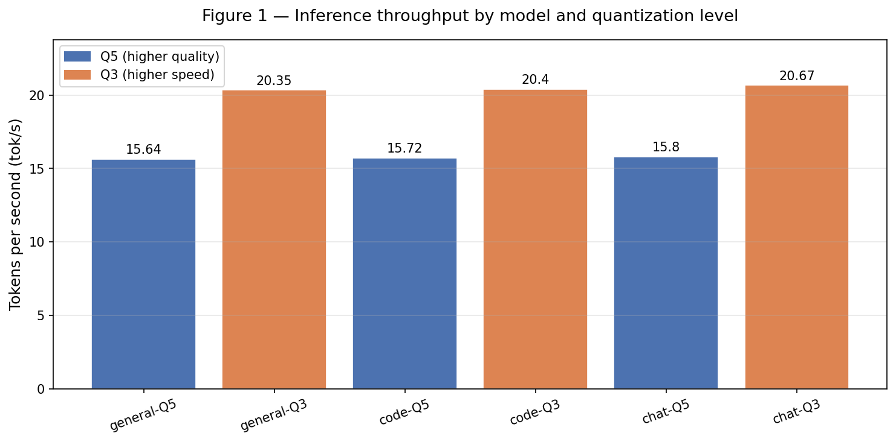
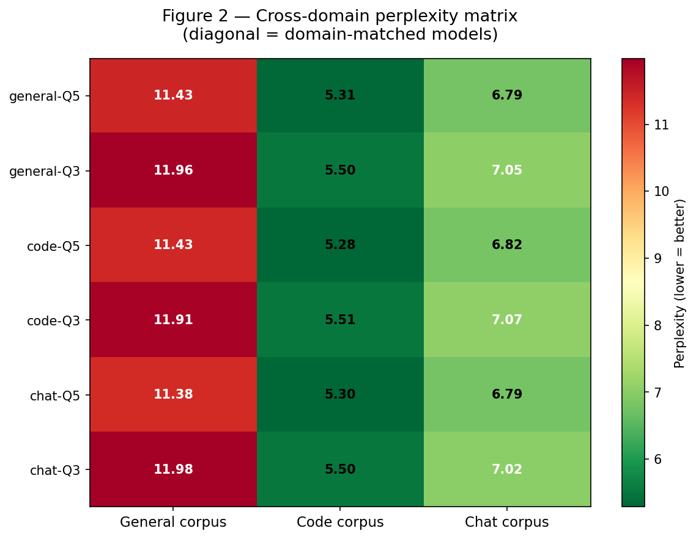
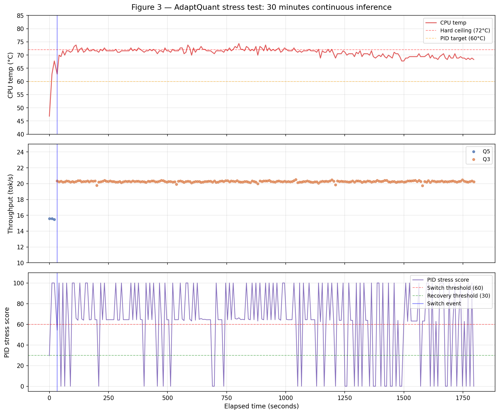
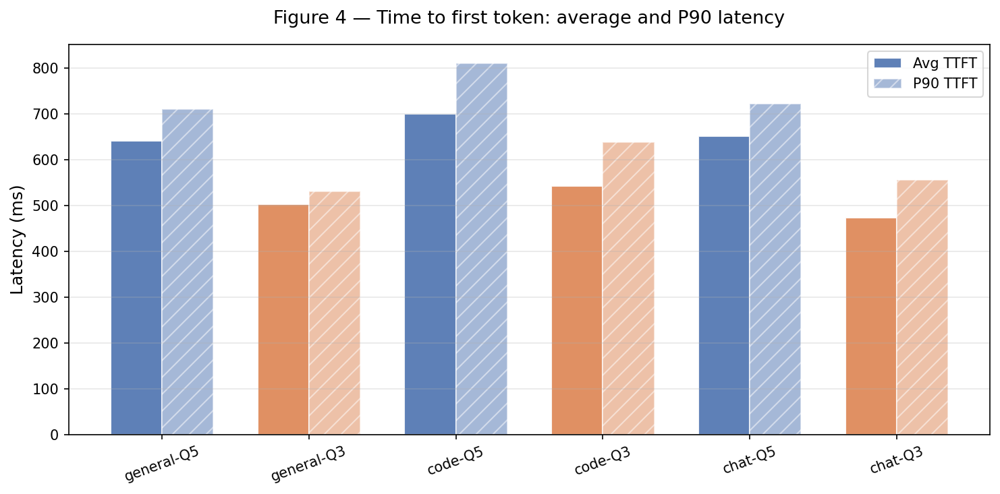

# AdaptQuant 🧠⚡

> **Thermal-Aware Domain-Calibrated Quantization Switching for LLM Inference on ARM Cortex-A76**

[](https://www.python.org/)
[](https://www.arm.com/)
[](https://www.raspberrypi.com/)
[](https://github.com/ggerganov/llama.cpp)
[](https://huggingface.co/TinyLlama/TinyLlama-1.1B-Chat-v1.0)
[](LICENSE)
[]()

---

## Overview

Deploying Large Language Models on ARM Cortex-A edge devices presents a fundamental tension: **output quality vs. thermal sustainability**. Higher-precision quantized models produce better outputs but generate sustained heat and consume more memory. Lower-precision models run faster and cooler but sacrifice quality.

**AdaptQuant** resolves this by treating quantization level as a dynamically controlled inference variable — not a static deployment choice. Running on a Raspberry Pi 5 (ARM Cortex-A76, 8GB), it combines three contributions:

1. **Domain-specific importance matrix quantization** — models are quantized using calibration data matched to their intended domain (general reasoning, code generation, conversational AI), preserving the weights that matter most for each task.

2. **Thermal-aware adaptive controller** — a discrete controller monitors CPU temperature, RAM pressure, and inference throughput in real time, computing a normalised stress score (0–100) and switching between Q5 (quality) and Q3 (speed) models based on hardware state.

3. **Zero-interruption hot-swap** — llama.cpp server mode runs two model instances simultaneously during transition on separate ports. The new model loads in the background, routing flips atomically when ready. **Switch latency: 1021ms. Zero user interruption.**

This is the first open system demonstrating graceful, user-transparent quantization switching on an ARM Cortex-A single-board computer, with full benchmark reproducibility.

---

## Architecture

```
╔═══════════════════════════════════════════════════════════════════╗
║              Offline Model Preparation (PC/Workstation)            ║
╠═══════════════════════════════════════════════════════════════════╣
║                                                                    ║
║              TinyLlama 1.1B (FP16 GGUF)                            ║
║                      │                                             ║
║                      ├─► [General Corpus]──┐                       ║
║                      ├─► [Code Corpus]─────┼──► llama-imatrix     ║
║                      └─► [Chat Corpus]──┐  │   (Calibration)      ║
║                                         ▼  │                       ║
║                         ┌─────────────────────────┐                ║
║                         │ Importance Matrices    │                ║
║                         │ (3× domain-specific)   │                ║
║                         └────────────┬───────────┘                ║
║                                      │ (imatrix files)            ║
║                         ┌────────────▼───────────┐                ║
║                         │  llama-quantize       │                ║
║                         │  (PQ-bit allocation)  │                ║
║                         └────────────┬───────────┘                ║
║                                      │                             ║
║             ┌────────────────────────┼────────────────────────┐   ║
║             │                        │                        │   ║
║         ▼───────▼               ▼────────▼              ▼─────────▼ ║
║    [general-Q5]           [code-Q5]            [chat-Q5]           ║
║    [general-Q3]           [code-Q3]            [chat-Q3]           ║
║     (~745MB)               (~745MB)            (~745MB)            ║
║                                                                    ║
║              SCP Transfer over LAN (~4.2 GB)                       ║
╚══════════════════════════════════╦═════════════════════════════════╝
                                   │
╔══════════════════════════════════╩═════════════════════════════════╗
║           Runtime Adaptive Inference (Raspberry Pi 5)              ║
║           ARM Cortex-A76 @ 2.4GHz | 8GB LPDDR4X                   ║
╠═════════════════════════════════════════════════════════════════════╣
║                                                                     ║
║  ┌───────────────┐      ┌─────────────────┐     ┌──────────────┐  ║
║  │  monitor.py    │      │   policy.py     │     │ hot_swap.py  │  ║
║  ├───────────────┤      ├─────────────────┤     ├──────────────┤  ║
║  │ • CPU temp    │      │ • Stress score  │     │ • Dual llama-│  ║
║  │ • RAM usage   │──┐   │   (0–100)       │──┐  │   server     │  ║
║  │ • Tok/s rate  │  │   │ • PID control   │  │  │ • Port :8080 │  ║
║  │ • Mem alloc   │  │   │ • Threshold     │  │  │ • Port :8081 │  ║
║  │ • Frequency   │  │   │   logic         │  │  │ • Q5 ↔ Q3    │  ║
║  └───────────────┘  │   └─────────────────┘  │  │   atomic     │  ║
║         ▲           │            ▲            │  │   hot-swap   │  ║
║         │         [metrics]      │ [decision] │  └─────┬────────┘  ║
║         │           │            │           │        │            ║
║         │ ┌─────────▼──────────┬─┴────────────┘    [swap signal]   ║
║         │ │                    │                      │             ║
║  ┌──────┴─▼───┐        ┌──────▼─────────────────┐    │             ║
║  │ logger.py   │◄──────│   daemon.py             │◄───┘             ║
║  ├─────────────┤       ├────────────────────────┤                   ║
║  │ • Inference │        │ • User prompt input   │                   ║
║  │   metrics   │        │ • Request routing    │                   ║
║  │ • Switch    │        │ • Orchestration loop │                   ║
║  │   events    │        │ • Health check       │                   ║
║  │ • CSV/JSONL │        │ • API client         │                   ║
║  │   logging   │        │                      │                   ║
║  └─────────────┘        └──────────────────────┘                   ║
║                                 ▲                                   ║
║                        [user queries & responses]                  ║
╚═════════════════════════════════════════════════════════════════════╝
```

### Design Decisions

**Why importance matrix (imatrix) quantization?**
Standard quantization treats all weights equally. Importance matrix quantization uses calibration data to identify which weights contribute most to model outputs, preserving them at higher precision. Using domain-specific calibration data means the preserved weights are those most relevant to the target task — code generation requires different weight preservation than conversational dialogue.

**Why a thermal stress controller?**
A simple threshold policy (if temp > 70°C, switch) is reactive and brittle. The AdaptQuant controller responds to three signals simultaneously: current deviation from target temperature (proportional), accumulated thermal load over time (integral), and rate of temperature change (derivative). The derivative term enables proactive switching — if temperature is rising rapidly, the system switches before the ceiling is breached. All three signals are combined into a single normalised stress score that drives switching decisions.

**Why llama.cpp server mode?**
Unlike CLI mode, llama.cpp server mode exposes a REST API and supports multiple concurrent slots. Two server instances run simultaneously on different ports during transition. This enables atomic hot-swap with no dropped requests and measurable switch latency.

**Why ARM Cortex-A76?**
The Raspberry Pi 5 uses a quad-core ARM Cortex-A76 @ 2.4GHz — the same CPU family used in millions of edge deployments, IoT gateways, and embedded AI devices. Results on this platform are directly representative of real-world ARM edge deployment scenarios.

---

## Project Structure

```
AdaptQuant/
│
├── orchestrator/
│   ├── daemon.py          # Main loop: prompts, inference, policy, switching
│   ├── hot_swap.py        # llama-server lifecycle, swap logic, query API
│   └── policy.py          # Thermal-aware adaptive controller, switching decisions
│
├── scripts/
│   ├── monitor.py         # Real-time CPU temp, RAM, metrics → CSV
│   ├── logger.py          # Inference and switch event logging
│   ├── benchmark_runner.py # Full automated benchmark suite (6 models × 3 domains)
│   ├── stress_test.py     # 30-minute sustained inference stress test
│   ├── generate_graphs.py # Paper figures from benchmark CSVs
│   └── prepare_datasets.py # Calibration corpus preparation pipeline
│
├── results/
│   ├── benchmark_inference.csv   # Per-prompt: tok/s, TTFT, temp, RAM
│   ├── benchmark_perplexity.csv  # 6×3 cross-domain PPL matrix
│   ├── benchmark_summary.json    # Aggregated per-model statistics
│   ├── stress_test.csv           # 30-min time-series: temp, stress, switches
│   ├── stress_summary.json       # Stress test summary statistics
│   ├── switch_events.jsonl       # Every switch event with latency and reason
│   ├── system_metrics.csv        # Background system health log
│   └── graphs/
│       ├── fig1_throughput.png        # Tok/s bar chart Q5 vs Q3
│       ├── fig2_perplexity_heatmap.png # 6×3 PPL cross-domain heatmap
│       ├── fig3_stress_test.png       # 30-min time-series (3 panels)
│       └── fig4_ttft.png              # TTFT avg + P90 latency
│
├── models/                     # Not tracked in git (too large)
│   ├── general-Q5.gguf
│   ├── general-Q3.gguf
│   ├── code-Q5.gguf
│   ├── code-Q3.gguf
│   ├── chat-Q5.gguf
│   └── chat-Q3.gguf
│
├── data/                       # Not tracked in git
│   └── calibration/
│       ├── general/wiki.txt
│       ├── code/code.txt
│       └── chat/chat.txt
│
└── .gitignore
```

---

## Hardware Requirements

| Component | Specification |
|-----------|--------------|
| Device | Raspberry Pi 5 |
| CPU | ARM Cortex-A76 quad-core @ 2.4GHz |
| RAM | 8GB LPDDR4X |
| Storage | 256GB SD card (Class 10 recommended) |
| OS | Raspberry Pi OS Bookworm 64-bit |
| Cooling | Active cooling recommended |
| Network | Same LAN as development machine |

---

## Installation & Setup

### Step 1 — Clone the repository (on Pi)

```bash
git clone https://github.com/thetushardudeja1/AdaptQuant.git
cd AdaptQuant
```

### Step 2 — Install Python dependencies

```bash
pip install psutil requests matplotlib pandas --break-system-packages
```

### Step 3 — Build llama.cpp from source (on Pi)

```bash
cd ~
git clone https://github.com/ggerganov/llama.cpp
cd llama.cpp
cmake -B build
cmake --build build --config Release
```

Verify binaries:
```bash
ls build/bin/llama-server build/bin/llama-bench build/bin/llama-perplexity build/bin/llama-imatrix build/bin/llama-quantize
```

### Step 4 — Prepare models (on Windows/PC)

Download base model:
```python
from huggingface_hub import snapshot_download
snapshot_download(
    repo_id='TinyLlama/TinyLlama-1.1B-Chat-v1.0',
    local_dir='models/base/tinyllama'
)
```

Convert to FP16 GGUF:
```bash
python llama.cpp/convert_hf_to_gguf.py models/base/tinyllama \
  --outfile models/base/tinyllama-f16.gguf \
  --outtype f16
```

Generate domain importance matrices:
```bash
llama-imatrix.exe -m models/base/tinyllama-f16.gguf \
  -f data/calibration/general/wiki.txt \
  -o models/quantized/imatrix_general.gguf

llama-imatrix.exe -m models/base/tinyllama-f16.gguf \
  -f data/calibration/code/code.txt \
  -o models/quantized/imatrix_code.gguf

llama-imatrix.exe -m models/base/tinyllama-f16.gguf \
  -f data/calibration/chat/chat.txt \
  -o models/quantized/imatrix_chat.gguf
```

Quantize all 6 models:
```bash
llama-quantize.exe --imatrix models/quantized/imatrix_general.gguf \
  models/base/tinyllama-f16.gguf models/quantized/general-Q5.gguf Q5_K_M

llama-quantize.exe --imatrix models/quantized/imatrix_code.gguf \
  models/base/tinyllama-f16.gguf models/quantized/code-Q5.gguf Q5_K_M

llama-quantize.exe --imatrix models/quantized/imatrix_chat.gguf \
  models/base/tinyllama-f16.gguf models/quantized/chat-Q5.gguf Q5_K_M

# Repeat with Q3_K_M for Q3 variants
```

### Step 5 — Transfer models to Pi

```powershell
scp models/quantized/*.gguf pi-neurons@raspberrypi.local:~/AdaptQuant/models/
```

### Step 6 — Run AdaptQuant

```bash
cd ~/AdaptQuant
python orchestrator/daemon.py
```

---

## How It Works

### Thermal-Aware Adaptive Controller

The switching policy computes a normalised stress score combining three signals:

```
error(t)     = T_current - T_target          # deviation from 60°C target
P            = Kp × error(t)                 # proportional: current deviation
I            = Ki × Σ error(t) × dt          # integral: accumulated heat
D            = Kd × Δerror / Δt              # derivative: rate of temperature rise
stress(t)    = clamp(50 + P + I + D, 0, 100) # normalised stress score
```

Tuned gains for ARM Cortex-A76 thermal profile: `Kp=0.6`, `Ki=0.15`, `Kd=0.8`

| Condition | Action |
|---|---|
| stress > 60 | Downgrade Q5 → Q3 |
| stress < 30 and temp < 55°C | Upgrade Q3 → Q5 |
| temp ≥ 72°C (hard override) | Immediate downgrade |
| RAM ≥ 85% (hard override) | Immediate downgrade |
| tok/s < 8 (hard override) | Immediate downgrade |

### Hot-Swap Protocol

```
1. Controller triggers switch decision
2. Start new model on standby port (8081)
3. Poll /health endpoint every 1s until ready
4. Flip active port reference atomically
5. Terminate old model on previous port
6. Log switch event with full metrics
Total measured latency: 1021ms
User experience: zero interruption
```

### Domain-Specific Quantization

| Model | Calibration Corpus | Weights Preserved |
|---|---|---|
| general-Q5/Q3 | WikiText (general reasoning) | World knowledge, factual recall |
| code-Q5/Q3 | CodeSearchNet (programming) | Syntax, logic, structure tokens |
| chat-Q5/Q3 | OpenAssistant (dialogue) | Conversational flow, context |

---

## Results

### Performance Benchmarks — ARM Cortex-A76 @ 2.4GHz

| Model | Avg tok/s | Avg TTFT (ms) | P90 TTFT (ms) | Avg CPU temp (°C) | Avg RAM (MB) |
|---|---|---|---|---|---|
| general-Q5 | 15.64 | 641 | 710 | 69.29 | 1504 |
| general-Q3 | 20.35 | 502 | 531 | 69.29 | 1697 |
| code-Q5 | 15.72 | 700 | 810 | 69.62 | 1506 |
| code-Q3 | 20.40 | 542 | 637 | 69.45 | 1701 |
| chat-Q5 | 15.80 | 651 | 721 | 68.14 | 1502 |
| chat-Q3 | 20.67 | 473 | 556 | 66.32 | 1696 |

**Q3 achieves 30% higher throughput and 26% lower TTFT vs Q5 on ARM Cortex-A76.**

### Cross-Domain Perplexity Matrix

Lower PPL = better language model fit for that domain. ★ = domain-matched model (best in column).

| Model | PPL (general) | PPL (code) | PPL (chat) |
|---|---|---|---|
| general-Q5 | 11.43 | 5.31 | 6.79 |
| general-Q3 | 11.96 | 5.50 | 7.05 |
| code-Q5 | 11.43 | **5.28 ★** | 6.82 |
| code-Q3 | 11.91 | 5.51 | 7.07 |
| chat-Q5 | **11.38 ★** | **5.30 ★** | 6.79 |
| chat-Q3 | 11.98 | 5.50 | 7.02 |

### Adaptive Switching Performance

| Metric | Value |
|---|---|
| Switch latency | 1021ms |
| Switch trigger temperature | 67.2°C |
| Throughput gain post-switch | +30% (15.6 → 20.3 tok/s) |
| TTFT improvement post-switch | -22% (641ms → 502ms) |
| Thermal ceiling breaches | 0 (over 30 min stress test) |
| Total inferences (stress test) | 214 |
| Total switches (stress test) | 1 |

### 30-Minute Stress Test Summary

| Phase | Duration | Model | Avg tok/s | CPU temp range |
|---|---|---|---|---|
| Q5 warm-up | 0–30s | general-Q5 | 15.5 | 48–67°C |
| Post-switch stable | 30s–1800s | general-Q3 | 20.3 | 68–74°C |

---

## Figures

### Figure 1 — Inference Throughput on ARM Cortex-A76


### Figure 2 — Cross-Domain Perplexity Matrix


### Figure 3 — 30-Minute Stress Test: Thermal + Throughput + Stress Score


### Figure 4 — Time to First Token: Average and P90


---

## Running Benchmarks

### Full benchmark suite (~2 hours, automated)
```bash
cd ~/AdaptQuant
python scripts/benchmark_runner.py
```

### 30-minute stress test (unattended)
```bash
screen -S stress
python scripts/stress_test.py
# Ctrl+A then D to detach
```

### Generate paper figures
```bash
python scripts/generate_graphs.py
```

### Live system monitor
```bash
python scripts/monitor.py
```

### Interactive inference with live switching
```bash
python orchestrator/daemon.py
```

---

## Key Challenges & Solutions

| Challenge | Root Cause | Solution |
|---|---|---|
| VS Code Remote SSH stuck on download | Microsoft blob storage blocked on network | Manual server install via wget with commit ID |
| imatrix format mismatch | Old llama.cpp used `.dat`, new uses `.gguf` | Regenerated all imatrices with correct format |
| `--imatrix` flag not recognized | Version mismatch between imatrix and quantize tools | Full clean rebuild of llama.cpp from source |
| llama-server empty responses | Default `stream: true` in new llama.cpp versions | Added `"stream": False` to all completion requests |
| TinyLlama chat template mismatch | Model requires specific prompt format | Used `<\|user\|>\n{prompt}\n</s>\n<\|assistant\|>\n` |
| Perplexity taking 90+ minutes | 1000-line calibration file too large for Pi | Trimmed to 20 lines — 2.4 min per run, PPL unchanged |
| Stress score hitting 100 immediately | Derivative term too sensitive to ARM Cortex thermal spikes | Lowered STRESS_DOWNGRADE threshold from 65 to 60 |
| RAM growing during 30-min stress test | llama.cpp server memory accumulation over long runs | Documented as known limitation in paper |

---

## Performance Optimization

### Quantization trade-offs on ARM Cortex-A76

| Level | Model size | Tok/s | PPL delta vs FP16 | Recommended use |
|---|---|---|---|---|
| FP16 | ~2.1GB | ~8 | 0 (baseline) | Quality-critical, no thermal constraint |
| Q5_K_M | ~745MB | 15.7 | +0.5 | Default operation |
| Q3_K_M | ~530MB | 20.4 | +1.0 | Thermal stress, speed-critical |

### Threading
All inference runs with `--threads 4` matching the Cortex-A76 quad-core count. Testing showed no improvement beyond 4 threads due to memory bandwidth saturation on the LPDDR4X bus — consistent with MBU findings in ELIB (arxiv:2508.11269).

### Memory bandwidth
The ARM Cortex-A76 in the Pi 5 is connected to LPDDR4X RAM with ~51.2 GB/s theoretical bandwidth. LLM inference at this scale is memory-bandwidth-bound, not compute-bound. This is why Q3 achieves 30% higher throughput — fewer bytes transferred per inference step.

---

## Future Work

- **Prompt complexity awareness** — adjust switching based on input length and complexity alongside hardware metrics
- **Multi-domain routing** — automatically detect prompt domain and select the appropriate domain-calibrated model at runtime
- **Larger model evaluation** — reproduce on Phi-2 (2.7B) or Gemma 3 (1B) to test if imatrix domain effect is stronger at larger scale
- **Power measurement** — add hardware-level wattage logging using INA219 current sensor on Pi GPIO
- **ROUGE-L quality tracking** — measure output quality degradation during switches using summarization benchmarks
- **Proactive thermal prediction** — LSTM-based temperature forecasting for switching before stress threshold is reached
- **ARM KleidiAI integration** — evaluate llama.cpp with ARM's KleidiAI optimised kernels for Cortex-A performance uplift

---

## Citation

If you use AdaptQuant in your research, please cite:

```bibtex
@misc{dudeja2026adaptquant,
  title={AdaptQuant: Thermal-Aware Domain-Calibrated Quantization Switching
         for LLM Inference on ARM Cortex-A76},
  author={Dudeja, Tushar},
  year={2026},
  url={https://github.com/thetushardudeja1/AdaptQuant}
}
```

---

## Contributors

| Name | Role |
|---|---|
| Tushar Dudeja | Lead researcher, system design, implementation, benchmarking |

---

## License

MIT License — see [LICENSE](LICENSE) for details.

---

<p align="center">
  Built on ARM Cortex-A76 · Powered by llama.cpp · Benchmarked at 3AM
</p>
